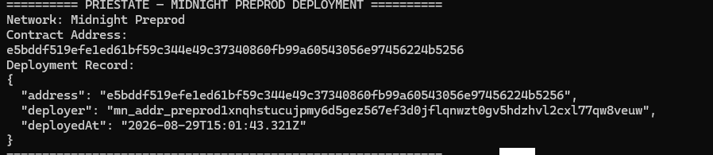

# midnight-moonshot

[](https://github.com/techwithjainparam/midnight-moonshot/actions/workflows/ci.yml)

Privacy-first dApp built on Midnight, evolving from a Compact smart contract to a production-ready Web3 application.

## What This Does

**PRIESTATE — Privacy-First Property Eligibility Proof**

A technical privacy prototype (not a land registry, legal ownership system, or marketplace). PRIESTATE lets a user **privately prove that a property value meets a predefined eligibility threshold without revealing the actual property value**.

The private property value is used inside the Compact zero-knowledge circuit to check:

```text
propertyValue >= eligibilityThreshold
```

Only the eligibility result is disclosed publicly on the ledger. The property value stays private forever.

## Status — Level 3

Classification used throughout this section:

* **REAL** — fully implemented, verified by tests, and shipping in this build.
* **PROVIDER-READY** — the factor/state machine and server enforcement are implemented, but live delivery still requires external provider credentials (not shipped).
* **DEMO-ONLY** — present to shape the UI/UX only; not a real security or identity boundary.
* **NOT AVAILABLE** — reported unavailable in the current build; no fake success.

| Stage | Status |
| ----- | ------ |
| Midnight privacy / ZK (Compact circuit, private property value, Boolean result only) | REAL |
| On-chain property registration lifecycle (`PENDING → APPROVED/REJECTED` + officer authorization) | REAL |
| Midnight wallet (DApp Connector v4.x, join by fixed preprod address) | REAL |
| Authentication (server-authoritative account sessions) | REAL |
| Registration / login | REAL |
| Registration liveness (68-point face landmarks + active challenges) | REAL (real face-api landmark inference, blind challenges; not depth/replay-proof) |
| Live location | REAL (browser geolocation + verification) |
| Biometric enrollment + login face matching | REAL (real face embedding extraction, encrypted server-side reference store, server-authoritative matched/mismatch verdict) |
| Google factor | PROVIDER-READY (needs live OAuth credentials) |
| SMS / WhatsApp OTP factors | PROVIDER-READY (needs live gateway credentials) |
| Aadhaar / KYC | NOT AVAILABLE / PROVIDER-READY architecture (no UIDAI-authorized provider connected) |
| Railway backend (verification API) | REAL (deployed, health 200) |
| Vercel frontend | REAL (deployed, live) |
| CI/CD (GitHub Actions: compile, typecheck, tests, build) | REAL (green) |
| Automated tests | REAL (436/436 tests passing) |
| Privacy / security model (AES-256-GCM at rest, fail-closed, PII/biometric off-ledger) | REAL |

**Live deployments:**
* Vercel frontend: https://priestate.vercel.app
* Railway backend: https://backend-production-25553.up.railway.app

No Google, SMS, WhatsApp, or Aadhaar/KYC capability is claimed as live; each is labelled PROVIDER-READY or NOT AVAILABLE above because live provider credentials are not configured. Biometric enrollment and login face matching ARE real and bundled (real face-api inference + encrypted server-side reference store).

## Level 3 User Flow

PRIESTATE follows the Option-A flow: **account creation does NOT require a Midnight wallet** — the wallet is associated after registration.

```
Landing
  │
  ▼
Register account (wallet-free, 11-step server stepper:
  personal → Aadhaar doc OCR → email → SMS OTP → WhatsApp OTP →
  Aadhaar-mobile link → password → photo → liveness → location → finalize)
  │
  ▼
Finalize → the CITIZEN CONNECTS their real Midnight wallet to bind it to the
  account (wallet association), then enrolls biometrics
  │
  ▼
Login / continuation (server-authoritative; wallet required) ──┐
  │                                                             │
  ▼                                                             │
Connect Midnight Wallet (if not already)                        │
  │                                                             │
  ▼                                                             │
Property registration (wallet-gated; on-chain)                  │
  │                                                             │
  ▼                                                             │
Privacy-preserving verification (ZK Boolean result)            │
  │                                                             │
  ▼                                                            │
Registry / Officer review (server-backed officer credential)    │
  │                                                             │
  ▼                                                             │
Approved / Rejected (on-chain lifecycle)          ←─────────────┘
```

* The **government / legal registry remains authoritative off-chain**; the
  Midnight ledger records *whether* a privacy-preserving claim holds and *who*
  authorized it — it does not replace government land records.
* Officer routes (`/officer`, `/officer/login`, `/officer/register`) are NOT
  wallet-gated; property registration and verification remain wallet-gated.

## Live Demo

https://priestate.vercel.app

## Preprod Contract Address

The **PRIESTATE Compact contract** is deployed on the **Midnight Preprod** network:

* **Network:** Midnight Preprod
* **Deployed Contract Address:** `fe251d3c8c26ccd56255a636c205c6b804489dbbaf41ddf316244ceb7f3159c2`

This is the deployed **PRIESTATE Compact** smart contract. The frontend joins this exact address on the Preprod network, and the property eligibility flow runs against this on-chain contract.

### Deployment Proof



## Privacy Model

PRIESTATE is built around a clear separation of what is public and what stays private.

### PUBLIC

The following is disclosed publicly on the Midnight ledger:

* The sealed **eligibility threshold** (`eligibilityThreshold`).
* The **designated officer** public key (`officer`).
* The **registration counter** and the **registry map** (`owner` binding, `area`, `status`, `district`, timestamps, reviewer).
* The Boolean **eligibility result** (`eligibilityResult`) — the final pass/fail verdict.

### PRIVATE

The **property value** (`propertyValue`) and the relevant private secrets — the applicant secret key and the officer secret key — remain private. They are used only inside the zero-knowledge circuit and are never written to the ledger.

### PROVES WITHOUT REVEALING

A user **proves** `propertyValue >= eligibilityThreshold` **without revealing the actual property value**. Only the eligibility result (true/false) becomes public on the ledger; the underlying property value stays private forever.

## Privacy Claim

PRIESTATE discloses only the Boolean `eligibilityResult` on the Midnight ledger for an eligibility check — never the `propertyValue`, the applicant secret key, or the officer secret key. Raw PII, passwords, face images, and biometric embeddings are stored off-ledger (server-side only, encrypted at rest) or never persisted at all. Any UI claim in this build is grounded in the deployed Compact contract; there are no fabricated verification pass/fail verdicts.

## Demo Video

https://youtu.be/UQwleyyFHqQ

## Tech Stack

* **Frontend:** Vite 8, React 19, React Router, TypeScript
* **Zero-knowledge:** Compact contract (`contracts/priestate.compact`), `compact` CLI, managed artifacts in `contracts/managed/priestate`
* **Midnight SDK:** `@midnight-ntwrk/compact-runtime` 0.16, `midnight-js-*` modules (fetch ZK config, indexer public-data, level private-state, node ZK config), DApp Connector API v4.x
* **Wallet:** `@midnight-ntwrk/wallet-sdk` (CLI deploy) + any DApp Connector v4.x wallet (browser)
* **Backend:** Node.js server (`server/index.ts`), `ws`, `nodemailer`
* **Storage:** SQLite (`better-sqlite3`)
* **Crypto:** Node `crypto` (scrypt, AES-256-GCM), `@scure/bip39`, `@scure/base`
* **CI/CD:** GitHub Actions (`node 22` → compact compile → tests → build)

## Prerequisites

* Node.js **22+** and npm
* The `compact` CLI toolchain (0.5.1 CLI / 0.31.1 toolchain), installed manually — see `.github/workflows/ci.yml`
* A Midnight DApp Connector v4.x wallet (Lace, 1AM, ...) for browser flows
* Docker Desktop (only for the local Midnight **proof server** used by CLI deployment)
* `.env` from `.env.example` (secrets are read server-side only)

## Setup & Run Locally

```bash
cp .env.example .env         # then fill in server-side credentials
npm install
npm run compile              # compact compile -> contracts/managed/priestate
npm run copy-circuits        # copy ZK artifacts to public/
npm run dev                  # Vite dev server on port 3000 (proxy: /api -> :8787)
```

To run the verification server:

```bash
set -a; source .env; set +a # no dotenv loader; env must be sourced
npm run verify-server        # verification API on :8787
```

## Run Tests

```bash
npm test                     # 436/436 passing (contract, auth, privacy, registry, officer, etc.)
npm run typecheck            # tsc --noEmit
npm run build                # typecheck + production build
```

## CI/CD

`.github/workflows/ci.yml` runs on **push to `main`** and **pull requests**: checkout → Node.js 22 → pinned compact toolchain install → `npm run compile` → `npm run copy-circuits` → `npm run typecheck` → `npm test` → `npm run build`. Status: [CI badge](https://github.com/techwithjainparam/midnight-moonshot/actions/workflows/ci.yml).

## Product Proposal

[PRIVESTATE Product Proposal](PROPOSAL.md) (repository root) — product and users, why Midnight specifically, data model (`Data Point / Type / Disclosed To`), and mainnet feasibility.

## Smart Contract

`contracts/priestate.compact`:

```compact
pragma language_version >= 0.23;

import CompactStandardLibrary;

export enum RegistrationStatus { PENDING, APPROVED, REJECTED }

export struct Registration {
  owner: Bytes<32>,          // owner/applicant binding (DApp public key)
  area: Uint<64>,            // public property area
  status: RegistrationStatus,
  district: Bytes<32>,       // registry metadata
  submittedAt: Uint<64>,     // registry metadata
  reviewedBy: Bytes<32>,     // officer DApp public key
  reviewedAt: Uint<64>,      // review timestamp
}

export sealed ledger eligibilityThreshold: Uint<64>;
export sealed ledger officer: Bytes<32>;             // designated officer DApp public key

export ledger registrationCounter: Counter;
export ledger registrations: Map<Uint<64>, Registration>;
export ledger eligibilityResult: Boolean;

witness propertyValue(): Uint<64>;           // private: property VALUE
witness applicantSecretKey(): Bytes<32>;     // private: derives owner binding
witness officerSecretKey(): Bytes<32>;       // private: authorizes review

export circuit submitRegistration(...);
export circuit approveRegistration(...);      // designated officer only
export circuit rejectRegistration(...);       // designated officer only
export circuit checkEligibility(): [];        // existing eligibility circuit
```

* **Public ledger metadata**: eligibility threshold, designated officer, registration counter, the registry map (owner binding, area, status, district, timestamps, reviewer), and the Boolean eligibility result.
* **Private witnesses**: the property **VALUE** (`propertyValue`), plus the applicant and officer secret keys — never published. Only derived DApp public keys are disclosed where a binding or authorization must be recorded.
* **eligibility threshold** and the **designated officer** are sealed once at deployment (`constructor(threshold, designatedOfficer)`).
* `checkEligibility` computes `propertyValue >= eligibilityThreshold` inside the circuit and discloses only the Boolean result to `eligibilityResult`.
* Officer authorization: `approveRegistration`/`rejectRegistration` re-derive the caller's DApp public key from `officerSecretKey` and `assert` it equals the sealed `officer` public key.

## Project Structure

```text
midnight-moonshot/
├── contracts/
│   ├── priestate.compact          # Compact smart contract source
│   └── managed/priestate/         # generated artifacts (gitignored)
│       ├── contract/              # generated contract API
│       ├── keys/                  # proving/verifying keys
│       └── zkir/                  # compiled circuit (zkir + bzkir)
├── server/                        # PRIESTATE verification API (email OTP + Aadhaar KYC)
├── src/
│   ├── auth/                      # auth context + role model
│   ├── components/                # React components (guards, navbar, etc.)
│   ├── contract/                  # CompiledPriestateContract + witnesses
│   ├── data/                      # mock properties + on-chain result storage
│   ├── documents/                 # document upload + extraction
│   ├── pages/                     # page components (Landing, Verify, Result, etc.)
│   ├── profile/                   # contact verification providers
│   ├── dapp-wallet.ts             # DApp Connector wallet integration
│   ├── priestate-api.ts           # PriestateAPI (deploy/join + lifecycle)
│   ├── browser-manager.ts         # BrowserPriestateManager
│   ├── contract-address.ts        # contract address resolution
│   └── in-memory-private-state-provider.ts
├── tests/                         # 436/436 tests passing (compile, wiring, result, privacy, etc.)
├── public/
│   ├── keys/                      # ZK artifacts (copied by copy-circuits)
│   └── zkir/
├── scripts/
│   └── copy-circuit-files.ts      # copies ZK artifacts to public/
├── .midnight-state.json           # wallet seed + deployment records (gitignored)
├── .midnight-wallet-state/        # wallet sync cache (gitignored)
├── index.html
├── package.json
├── tsconfig.json
├── vite.config.ts
└── docker-compose.yml             # proof server container
```

## Commands

```bash
npm install          # install dependencies
npm run compile      # compact compile contracts/priestate.compact contracts/managed/priestate
npm run copy-circuits# copy ZK artifacts to public/ for browser fetch
npm run test         # run the test suite (tsx --test)
npm run typecheck    # tsc --noEmit
npm run dev          # start the Vite dev server (port 3000)
npm run verify-server# start the verification API (email OTP / Aadhaar KYC)
npm run build        # typecheck + production build
npm run preview      # serve production build locally
npm run deploy       # deploy contract to network (requires wallet sync + proof server)
npm run network      # show/set active network
npm run check-balance# check wallet balance
npm run proof-server:start  # start proof server (Docker)
npm run proof-server:stop   # stop proof server
npm run clean        # remove generated artifacts and build output
```

### Generated Artifacts

`compact compile` writes the following under `contracts/managed/priestate/`:

```text
├── compiler/contract-info.json   # interface metadata (circuits, witnesses, ledger)
├── contract/index.js             # generated contract API (+ index.d.ts, .js.map)
├── keys/<circuit>.prover         # proving key (per exported circuit)
├── keys/<circuit>.verifier
└── zkir/<circuit>.zkir           # compiled circuit (+ .bzkir)
```

## Notes

* `contracts/managed/` is gitignored and regenerated with `npm run compile`.

## Wallet Connection

PRIESTATE connects to any Midnight DApp Connector v4.x wallet (Lace, 1AM, etc.):

* Browser: `src/dapp-wallet.ts` initializes providers via `connectedAPI.getProvingProvider()`
* CLI deploy: `src/wallet.ts` uses `wallet-sdk` directly with `WalletFacade`
* Wallet seed/mnemonic stored in `.midnight-state.json` (gitignored)
* Wallet sync state cached in `.midnight-wallet-state/` (gitignored)

## Zero-Knowledge Proof Flow

The verification flow proves `propertyValue >= eligibilityThreshold` without revealing the property value:

1. User connects wallet and navigates to `/verify/:id`
2. `VerifyPage` calls `manager.resolve()` → joins the deployed contract
3. `PriestateAPI.checkEligibility(propertyValue)`:
   - Sets `_propertyValue` in the witness module (never exposed to ledger)
   - Calls `callTx.checkEligibility()` → wallet generates ZK proof
   - Submits proof transaction via `submitTx()`
   - Waits for on-chain confirmation via `firstResultAfterTx()`
4. Post-transaction indexer emits the new `eligibilityResult` (Boolean)
5. Result saved to `sessionStorage` → displayed on `/verification/:id`

Privacy guarantee: only `eligibilityResult` (true/false) is disclosed on-chain. The property value stays private.

## Preprod Network

The project targets Midnight Preprod by default (`VITE_NETWORK_ID=preprod`):

* RPC: `https://rpc.preprod.midnight.network`
* Indexer: `https://indexer.preprod.midnight.network/api/v4/graphql`
* WebSocket: `wss://indexer.preprod.midnight.network/api/v4/graphql/ws`
* Faucet: `https://midnight-tmnight-preprod.nethermind.dev`

### Deployment

```bash
# 1. Start proof server (required for ZK proof generation)
npm run proof-server:start

# 2. Deploy contract (requires wallet sync + funded wallet + PRIVATE_STATE_PASSWORD)
PRIVATE_STATE_PASSWORD="<>=16 chars>" npm run deploy -- --network preprod

# 3. Restart dev server to pick up the deployed address
npm run dev
```

The deployment script:
* Restores wallet from `.midnight-wallet-state/preprod/`
* Waits for wallet sync (resumes from checkpoint)
* Funds wallet from faucet if needed
* Registers UTXOs for DUST generation
* Deploys contract via `deployContract()`
* Saves contract address to `.midnight-state.json`

### Contract Address Lifecycle

```
npm run deploy
  → writes address to .midnight-state.json.deployments.preprod
    → vite.config.ts reads .midnight-state.json at build/dev start
      → injects __PRIESTATE_DEPLOYED__ = { network: "preprod", address: "..." }
        → src/contract-address.ts resolves the address
          → BrowserPriestateManager.resolve() joins the deployed contract
```

No manual hardcoding required. The address flows automatically from deployment to runtime.

## Proof Server

A local proof server is required for ZK proof generation during deployment:

```bash
npm run proof-server:start   # starts midnightntwrk/proof-server:8.1.0 on port 6300
npm run proof-server:stop    # stops the container
```

The browser uses the wallet's built-in proving provider (no local proof server needed for verification). The proof server is only required for CLI deployment scripts.

## Environment Variables

All secrets use plain (non-`VITE_*`) env vars — never bundled into client JS:

```bash
# .env (gitignored)
VITE_NETWORK_ID=preprod
PRIVATE_STATE_PASSWORD="<>=16 chars"    # encrypts local private-state DB
OTP_HASH_SECRET="<hex>"                # HMAC for OTP hashing
SMTP_HOST=smtp.gmail.com               # email OTP delivery
SMTP_USER=...                          # SMTP credentials
SMTP_PASS=...
```

## Access Control & Roles

PRIESTATE separates public, protected user, and officer functionality.

### Route visibility

| Route | Visibility |
| ----- | ---------- |
| `/` | **Public** — landing page, product information, Connect Wallet CTA |
| `/register-account` | **Public** — wallet-free account registration stepper |
| `/login` | **Public** — account-type chooser |
| `/officer/login`, `/officer/register`, `/officer` | **Officer** — NOT wallet-gated; server-backed officer credential (with clearly-labelled demo fallback) |
| `/login/user`, `/identity-verification`, `/profile/verify` | **Protected** — require a connected wallet (account continuation) |
| `/register`, `/register/review`, `/registry`, `/property/:id`, `/verify/:id`, `/verification/:id`, `/dashboard` | **Protected** — require a connected wallet + verified contact profile |

Behavior:

* When the wallet is disconnected (or its state is still unknown), protected
  routes render no application content. Direct navigation shows
  **“Connect your wallet to access PRIESTATE.”**
* While wallet state is loading (`detecting` / `connecting`) guards render
  nothing, so protected content never flashes before authorization is known.
* Disconnecting immediately removes access to all protected routes.
* The navbar hides Register / Registry / Dashboard when disconnected and never
  shows Officer navigation to normal users.

### Role model

```
wallet connected → determine role → USER | OFFICER
```

Implemented in `src/auth/roles.ts`; exposed app-wide by `AuthProvider`
(`src/auth/AuthContext.tsx`), which wraps the existing `useWallet` hook —
wallet logic exists in exactly one place and route guards reuse it.

* **USER** — sees only their own application/property information plus the
  explicitly public registry (finalized APPROVED records). Officer queues,
  internal notes, approve/reject controls, and other applicants' data are not
  rendered anywhere in the user experience.
* **OFFICER** — sees the Authorized Officer Portal (`/officer`) with pending
  applications, applicant/property review data, review timeline, internal
  notes, ZK status, and Approve/Reject controls.

### Officer authorization (server-backed credential + demo fallback)

Officer authorization has two layers; the server-backed credential is the
PRIMARY gate and the wallet-based demo role is a clearly-labelled fallback:

1. **Server-backed officer credential (REAL, primary).** A single officer
   account is minted once per deployment, gated by a one-time commissioning
   code (`OFFICER_REGISTRATION_CODE`). It uses a SEPARATE session cookie
   (`priestate_officer_sid`), salted-scrypt passwords, and the guard checks it
   FIRST (`src/components/guards/RequireOfficer.tsx`,
   `server/account/officer.ts`, `src/auth/officer-api.ts`). With no
   commissioning code configured the server reports registration
   `unavailable` (fail closed) — it never fakes an officer.
2. **Demo fallback (DEMO-ONLY, labelled).** `src/auth/roles.ts` treats
   `VITE_DEMO_OFFICER_ADDRESSES` wallet addresses as officers, or offers the
   "Simulate Officer Sign-In (DEMO)" control for the current browser session.

This is an application credential for the PRIESTATE portal, not government
authentication. On-chain `approve`/`reject` is still enforced by the Compact
circuit (only a wallet holding the officer secret — or the demo officer seed —
satisfies `officerSecretKey`). A real deployment must integrate the
responsible authority's identity system.

## Demo Mode

When the verification server is unreachable, the client enters demo mode:

* **Email OTP**: accepts the fixed demo code `123456` (no email sent)
* **Aadhaar**: shows "Aadhaar-linked mobile verification is not available in this demo"
* **Demo banner**: "Demo Mode — No email was sent. Use verification code **123456**"

Demo mode is clearly labeled in the UI. No real Aadhaar data is collected or transmitted.

## Record model — append-only history

Finalized property records are modeled as an ordered log of events
(`src/data/record-history.ts`). Events are only ever **appended** — there is
no API to edit or delete them. A finalized registration stays in history, and
future changes must be recorded as new authorized events:

```
PROPERTY reg-004
├─ 2023-08-05  Registration SUBMITTED   (by USER)
├─ 2023-08-10  Registration APPROVED    (by OFFICER)  ← finalized
└─ <future>    e.g. Ownership Transfer REQUESTED/APPROVED
               (new authorized events; previous entries remain)
```

The property page renders this history as a timeline and marks finalized
records: they cannot be edited, deleted, or silently replaced. Officer
decisions in the portal append new events rather than rewriting state.

### ⚠️ Security limitations (read before relying on any of this)

* **Frontend code alone does NOT make records tamper-proof.** The append-only
  store is an in-browser demo of the data model and UI. Anyone with access to
  the client runtime can alter it.
* True immutability/tamper-resistance must be enforced by the appropriate
  backend / blockchain / cryptographic authorization layer (e.g. recording
  each event on Midnight as an authorized transaction). The PRIESTATE Compact
  contract was intentionally **not** modified to simulate this.
* Role checks, route guards, and demo ownership bindings
  (`DEMO_USER_PROPERTY_IDS`) are client-side UX controls, not security
  boundaries.
* All registry records are mock data.

## Contact & identity verification

The Level 3 account flow is: **Register account (wallet-free) → Finalize →
Connect wallet to associate → Biometric enrollment → Login → verified
profile → Register / Dashboard** (officers bypass the contact gate). The full
registration stepper (`/register-account`) is served by `server/registration/`
and runs: personal + Aadhaar → Aadhaar document OCR → email → SMS OTP →
WhatsApp OTP → Aadhaar-mobile link → password → photo → liveness → location →
finalize. Every decision (verified booleans, hashes, evidence acceptance) is
server-authoritative; identity/KYC and liveness verification run against a
small server-side API (`server/`), never in the browser:

* **Email** — the API generates a 6-digit OTP, stores only an HMAC of it, and
  delivers it to the user's inbox via authenticated SMTP. Codes expire, are
  single-use, allow limited attempts, have a resend cooldown, and both per-
  contact and per-IP rate limits. The code is never displayed in the browser,
  never stored in `localStorage`, and never returned by any endpoint.
* **Aadhaar-linked mobile** — performed by an **authorized identity/KYC
  provider** (e.g. Surepass / Karza / Signzy / IDfy / Protean). A plain SMS
  OTP proves possession only and is NOT used. The adapter supports direct
  mobile→Aadhaar link checks and vendor OTP challenges to the registered
  mobile; ambiguous vendor answers fail closed. Only the provider receipt
  (`providerVerificationId`, status, timestamp) is stored — no Aadhaar number.
* Without configured credentials the UI honestly shows
  “Verification service unavailable.” /
  “Aadhaar-linked mobile verification is currently unavailable.” — there is
  no demo fallback in the production flow. (A development mock remains only
  for automated tests.)

### Login face verification (Level 3 Part 6) — implementation status

The **login** flow runs a mandatory five-factor authentication
(Wallet → Google → SMS OTP → WhatsApp OTP → Password) and then a distinct,
explicit **login face-verification identity stage** on top. This stage is
deliberately separate from the motion-only **liveness** check used during
registration:

* **Liveness** (Part 4) answers *"is a real, live person in front of the
  camera?"* using in-memory motion evaluation.
* **Face matching** (Part 6) answers *"does the live face match a registered
  identity reference?"* — a separate biometric capability. Motion alone is
  never treated as a face match, and a successful identity-verification stage
  is never silently treated as a login factor.

Accurate status of the current build:

**REAL (implemented):**
* Camera access where the device supports it (`src/liveness/camera-capture.ts`).
* Real 68-point landmark liveness with active blink/turn/closer/head challenges
  (`src/liveness/landmark.ts`, `landmark-verifier.ts`) — real inference via
  `@vladmandic/face-api` served from `public/models/`, fail-closed on model
  load failure.
* An explicit login face-verification state machine
  (`src/liveness/login-face-machine.ts`) whose **only** path to
  `identity_verified` is a real provider `verification_result` of `matched` —
  there is no event that sets "matched = true" directly.
* Real biometric reference enrollment + server-authoritative login face
  matching: the server derives a 128-d embedding from real face-api captures,
  encrypts it at rest under a separate `ACCOUNT_BIOMETRIC_ENC_SECRET` key
  (AES-256-GCM, domain-separated), and returns only a `matched`/`mismatch`
  verdict computed server-side (`server/account/biometric.ts`,
  `server/account/service.ts`). Single-use, wallet- and reference-version-bound
  tokens; any client-supplied `matched`/`score` is ignored.
* Provider capability discovery (`src/liveness/face-verification.ts`).
* Fail-closed behavior: absent capability or absent reference, the stage
  reports `verification_unavailable` and never silently succeeds.
* Honest UI (`src/components/LoginFaceVerification.tsx`) that distinguishes
  camera requesting/ready, liveness, face verification, passed, mismatch,
  insufficient quality, no face, multiple faces, camera denied/unavailable,
  provider unavailable, error, and timeout/cancel.
* Privacy boundaries: camera frames stay in memory; no face, embedding, or
  biometric value reaches the ledger, URLs, query params, logs, localStorage,
  or any public/account response (the server exposes only booleans/verdicts).
* Server-authoritative authentication: `AccountService.login()` (password +
  factors + `identityVerified`) remains the only path that mints a session;
  no client self-affirmed face match can mint one.

Membership of `identityVerified=true` is set **only** by the server at
successful biometric enrollment; the old bare-`confirmed:true`
`/api/v1/account/identity-verified` trust path was removed.

**PROVIDER-READY / NOT CURRENTLY AVAILABLE in this build:**
* Real anti-spoofing beyond landmark challenges: depth/silent-liveness,
  replay/photo/video liveness resistance.
* Official Aadhaar identity verification (a UIDAI-authorized AUA integration is
  required; not claimed without one).

Because the lens mentioned above is real CV + a real reference store, the
login face stage runs a genuine server-authoritative match; motion is never
treated as a face match, and a bare `verification_unavailable` still does not
fake completion.

### Running it

```bash
cp .env.example .env      # fill in SMTP + KYC credentials (server-side only)
set -a; source .env; set +a   # load env into the Node process (no dotenv loader)
npm run verify-server     # verification API on :8787
npm run dev               # Vite proxies /api → :8787 in development
```

The verify server reads configuration directly from environment variables — there
is no dotenv loader — so the `.env` file must be sourced into the shell before
starting it. Secret values are never echoed or logged.

All secrets live in plain (non-`VITE_*`) environment variables read only by
the Node process. The only frontend-visible variable is
`VITE_VERIFICATION_API_URL` — a public URL, not a credential.
